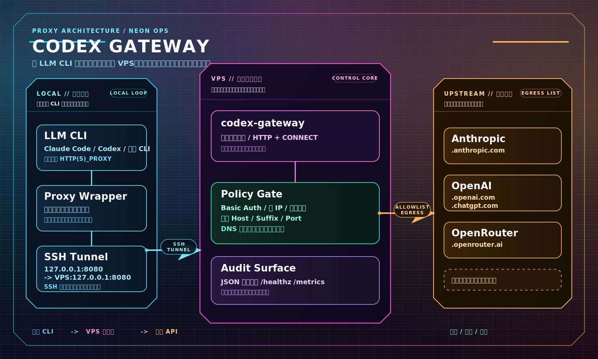

<div align="center">

# Codex Gateway

🚪 面向 Codex、Claude Code 等 CLI 的轻量显式代理。把出网统一收口到你的 VPS，并在出口侧做 Basic Auth、目标白名单和审计。

[English](./README_EN.md)

</div>

## ⚡ Quick Start

推荐架构：代理跑在 VPS，client 只连本地入口；出网、鉴权、目标限制和审计都留在 VPS。

### 推荐：🤖 让 LLM 代你部署

1. `git clone` 这个仓库
2. 把 [SEND_THIS_TO_LLM.md](./SEND_THIS_TO_LLM.md) 这个文件直接发给 LLM
3. 回答它追问的少量配置问题
4. 它会读取仓库里的部署示例，完成服务端部署，并返回客户端配置

### 架构图



两种接入方式共用同一套拓扑：LLM CLI 只连本地代理入口，VPS 负责转发和控制。

### 1. VPS 上部署服务端

```bash
cp deploy/vps.example.yaml deploy/vps.yaml
```

先改：

- `users[0].password`
- 不想用默认账号，再改 `users[0].username`
- 要放行额外域名，再改 `runtime.dest_suffix_allowlist`

执行部署：

```bash
go run ./cmd/codex-gateway deploy vps
systemctl --user status codex-gateway.service --no-pager
```

如果 VPS 上没有可用的 `systemd --user`，把 `service_scope: system` 写进 `deploy/vps.yaml`，再以 root 重新执行。

这会生成 `.env`、`config/users.txt`、二进制和对应的 `systemd` 服务。

### 2. Client 端选择一种接入方式

两种方式都可以。区别在于：手动管理本地 tunnel 和代理环境变量，还是生成本地脚本。

#### 方式 A：手动打通 tunnel 并设置代理环境变量

先打通到 VPS 的本地隧道：

```bash
ssh -NT \
  -L 127.0.0.1:8080:127.0.0.1:8080 \
  <ssh.user>@<ssh.host>
```

然后在当前 shell 设置代理环境变量：

```bash
export HTTP_PROXY=http://<proxy.username>:<proxy.password>@127.0.0.1:8080
export HTTPS_PROXY="$HTTP_PROXY"
```

这种方式下，直接在当前 shell 启动 client，无需运行 `deploy client`。

#### 方式 B：生成本地 tunnel + wrapper

如果你想把 SSH 隧道、代理环境变量和启动命令固化为本地脚本，就用这一种：

```bash
cp deploy/client.example.yaml deploy/client.yaml
```

先改：

- `ssh.user`
- `ssh.host`
- `proxy.password` 改成与服务端一致
- 如果你改了用户名，再把 `proxy.username` 一起改掉

执行部署：

```bash
go run ./cmd/codex-gateway deploy client
```

如果本机不适合 `systemd --user`，也可以改成 `service_scope: system` 后以 root 安装。

如果只想生成文件，不立即 build / restart：

```bash
go run ./cmd/codex-gateway deploy vps --write-only
go run ./cmd/codex-gateway deploy client --write-only
```

### 3. 开始使用

按接入方式启动：

- 方式 A：在已经设置代理环境变量的 shell 里直接运行 `codex`
- 方式 B：通过本地 wrapper 启动 `~/.local/bin/codex-gateway-proxy codex`

## ✨ 核心特性

- 标准显式代理：HTTP forwarding + HTTPS `CONNECT`
- 安全控制：Basic Auth、源 IP allowlist、每 IP 并发限制
- 出口约束：目标 host / suffix / port allowlist
- SSRF 防护：DNS 解析后二次校验，默认拒绝私网和保留地址
- 可观测性：JSON 日志、`/healthz`、可选 `/metrics`
- 部署友好：单二进制、Docker、Compose、YAML 一键部署

## 🔍 和普通 SSH / SOCKS 代理有什么不同

如果你只想把流量绕到 VPS，普通 SSH 隧道或 SOCKS 代理通常就够了。`codex-gateway` 补的是面向 LLM CLI 的控制面：

- SSH / SOCKS 提供通道；`codex-gateway` 增加 Basic Auth、源 IP 和并发控制
- 普通代理主要做转发；`codex-gateway` 还能限制 host / suffix / port，只放行指定模型域名
- 普通代理通常不做 DNS 结果复检；`codex-gateway` 默认拒绝解析到私网或保留地址的目标
- SSH 登录日志不是代理审计；`codex-gateway` 记录用户名、目标、状态码、字节数和耗时
- 内置 client wrapper，可让只有 `codex` 这类指定命令走代理；无需全局设置代理

换句话说：SSH 解决“怎么到 VPS”；`codex-gateway` 解决“放行什么、如何审计”。

## 🧭 设计原则

- 这是显式代理，不是厂商 API Gateway
- 默认监听 `127.0.0.1`，推荐通过 SSH / WireGuard / 私网入口访问
- 不改写协议，不托管上游 API Key，不做 HTTPS MITM
- 默认配置保守，先最小放行，再按需扩容

## ⚙️ 完整配置

- 环境变量方式：[.env.example](./.env.example)
- 服务端一键部署 YAML：[deploy/vps.example.yaml](./deploy/vps.example.yaml)
- 客户端一键部署 YAML：[deploy/client.example.yaml](./deploy/client.example.yaml)
- Docker / Compose：[docker-compose.yml](./docker-compose.yml)
