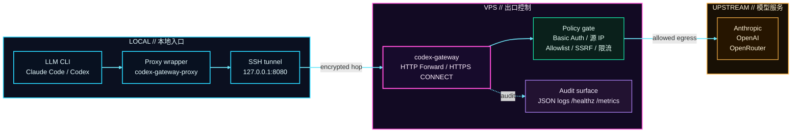

<div align="center">

# Codex Gateway

🚪 一个给 Claude Code、Codex 这类支持代理的 LLM CLI 使用的轻量显式代理。把出网流量统一收口到你自己的 VPS，再用 Basic Auth、目标域名白名单和审计日志做简洁但实用的控制。

[English](./README_EN.md)

</div>

## 🤖 最优先用法

如果你正在使用一个能读文件、改文件、执行终端命令的 LLM / agent，最省事的方式不是手工改 YAML，而是：

1. `git clone` 这个仓库
2. 把 [SEND_THIS_TO_LLM.md](./SEND_THIS_TO_LLM.md) 这个文件直接发给 LLM
3. 回答它追问的少量配置问题
4. 它会自己读取仓库里的部署示例，在当前机器上完成服务端部署，并把客户端需要的配置返回给你

这条路径应该优先于下面的手工 Quick Start。

## ⚡ Quick Start

推荐默认架构：VPS 上运行代理，本地通过 SSH 隧道接入。

### 架构图



推荐路径里，LLM CLI 只连接本地代理入口；真正的出网、鉴权、目标约束和审计都集中在 VPS 侧。

### 1. VPS 上部署服务端

```bash
cp deploy/vps.example.yaml deploy/vps.yaml
```

先改这几项：

- `users[0].password`
- 如果你不想用默认账号，再改 `users[0].username`
- 如果要放行额外域名，再改 `runtime.dest_suffix_allowlist`

默认示例已经包含常见模型服务域名：

- `.anthropic.com`
- `.openai.com`
- `.openrouter.ai`
- `.chatgpt.com`

执行部署：

```bash
go run ./cmd/codex-gateway deploy vps
systemctl --user status codex-gateway.service --no-pager
```

这会生成 `.env`、`config/users.txt`、本地二进制，并安装对应的 `systemd --user` 服务。

### 2. 本地部署 client

```bash
cp deploy/client.example.yaml deploy/client.yaml
```

先改这几项：

- `ssh.user`
- `ssh.host`
- `proxy.password` 改成与服务端一致的密码
- 如果你改了用户名，再把 `proxy.username` 一起改掉

执行部署：

```bash
go run ./cmd/codex-gateway deploy client
```

### 3. 开始使用

```bash
~/.local/bin/codex-gateway-proxy codex
```

如果只想生成文件，不立即 build / restart：

```bash
go run ./cmd/codex-gateway deploy vps --write-only
go run ./cmd/codex-gateway deploy client --write-only
```

## ✨ 核心特性

- 标准显式代理：HTTP forwarding + HTTPS `CONNECT`
- 安全控制：Basic Auth、源 IP allowlist、每 IP 并发限制
- 出口约束：目标 host / suffix / port allowlist
- SSRF 防护：DNS 解析后二次校验，默认拒绝私网和保留地址
- 可观测性：JSON 日志、`/healthz`、可选 `/metrics`
- 部署友好：单二进制、Docker、Compose、YAML 一键部署

## 🧭 设计原则

- 这是显式代理，不是厂商 API Gateway
- 默认只监听 `127.0.0.1`，推荐通过 SSH / WireGuard / 私网入口访问
- 不做协议改写，不托管上游 API Key，不做 HTTPS MITM
- 默认配置偏保守，先最小放行，再按需扩容

## ⚙️ 完整配置

- 环境变量方式：[.env.example](./.env.example)
- 服务端一键部署 YAML：[deploy/vps.example.yaml](./deploy/vps.example.yaml)
- 客户端一键部署 YAML：[deploy/client.example.yaml](./deploy/client.example.yaml)
- Docker / Compose：[docker-compose.yml](./docker-compose.yml)

最常改的项：

- `users`
- `DEST_SUFFIX_ALLOWLIST` / `runtime.dest_suffix_allowlist`
- `DEST_HOST_ALLOWLIST`
- `DEST_PORT_ALLOWLIST`
- `SOURCE_ALLOWLIST_CIDRS`
- `PROXY_TLS_ENABLED`
