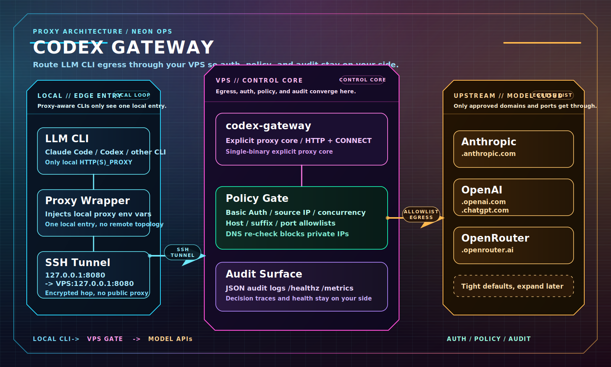

<div align="center">

# Codex Gateway

🚪 A lightweight explicit proxy for Codex, Claude Code, and other proxy-capable LLM CLIs. Centralize egress on your VPS and control it with Basic Auth, destination allowlists, and audit logs.

[简体中文](./README.md)

</div>

## 🤖 Let An LLM Deploy It

If your LLM / agent can read files, edit files, and run commands, the shortest path is to skip manual YAML editing:

1. `git clone` this repo
2. Send [SEND_THIS_TO_LLM.md](./SEND_THIS_TO_LLM.md) directly to the LLM
3. Answer the small set of follow-up questions it asks
4. Let it read the deploy examples, complete the server deployment on the current machine, and return the client-side config

If you already plan to use an agent for setup, this is usually simpler than the manual quick start below.

## ⚡ Quick Start

Recommended setup: run the proxy on a VPS and expose one local entrypoint on the client; keep egress, auth, destination policy, and audit on the VPS.

### Good Fit

- You want only `codex`, `claude code`, or similar commands to use the proxy
- You want model traffic to exit through your own VPS with allowlists and audit
- You still want SSH-tunnel-style access, but with more egress control than plain SSH / SOCKS

### Not A Good Fit

- You only need a generic proxy; plain SSH / SOCKS is usually enough
- You need a vendor API compatibility layer, protocol translation, or HTTPS MITM
- You need a server-side cluster, shared state, or load balancing

### Architecture



Both client-side modes share the same topology: the LLM CLI talks only to a local proxy endpoint, and the VPS handles forwarding and policy.

### 1. Deploy the server on the VPS

```bash
cp deploy/vps.example.yaml deploy/vps.yaml
```

Start with:

- `users[0].password`
- If you do not want the default username, also change `users[0].username`
- If you need more destinations, extend `runtime.dest_suffix_allowlist`

The sample already includes common model service domains:

- `.claude.ai`
- `.claude.com`
- `.anthropic.com`
- `.openai.com`
- `.openrouter.ai`
- `.chatgpt.com`

The default sample also allowlists the exact host `storage.googleapis.com` through `runtime.dest_host_allowlist` to cover Claude Code's legacy download path while that migration is still in progress.

Avoid removing the allowlist entirely or approximating a wildcard. A better default is to allow vendor product domain families such as `.anthropic.com`, `.claude.com`, and `.claude.ai`, then add a small number of exact hosts only when needed.

If Claude Code cannot connect to `platform.claude.com`, your current allowlist is missing `.claude.com`. Add it to `runtime.dest_suffix_allowlist` and rerun the deployment.

Run the deploy:

```bash
go run ./cmd/codex-gateway deploy vps
systemctl --user status codex-gateway.service --no-pager
```

If the VPS does not have a usable `systemd --user`, set `service_scope: system` in `deploy/vps.yaml` and rerun as root.

This writes `.env`, `config/users.txt`, the binary, and the matching `systemd` service.

If you use this proxy for `codex`, `claude code`, or similar CLIs that open many concurrent HTTPS tunnels, do not keep `runtime.max_conns_per_ip` too low. A practical starting point is `128`; generic-proxy values such as `16` tend to trigger `429` responses and then show up as "slow" client retries.

### 2. Choose One Client-Side Entry Mode

Both modes work. The difference is whether you manage the local tunnel and proxy env vars yourself or generate local helper files.

For multiple VPS backends, set `endpoints` in `deploy/client.yaml`. This generates one tunnel service per endpoint; the wrapper picks the first reachable one by default, or you can force one with `--endpoint <name>` or `CODEX_GATEWAY_ENDPOINT=<name>`. This is client-side failover, not a server cluster.

#### Mode A: Open The Tunnel And Set Proxy Env Vars Manually

First open a local tunnel to the VPS:

```bash
ssh -NT \
  -L 127.0.0.1:8080:127.0.0.1:8080 \
  <ssh.user>@<ssh.host>
```

Then set the proxy env vars in that shell:

```bash
export HTTP_PROXY=http://<proxy.username>:<proxy.password>@127.0.0.1:8080
export HTTPS_PROXY="$HTTP_PROXY"
```

With this mode, run the client from that shell; `deploy client` is not needed.

#### Mode B: Generate A Local Tunnel + Wrapper

Use this if you want local helper files for the SSH tunnel, proxy env vars, and launch command:

```bash
cp deploy/client.example.yaml deploy/client.yaml
```

Start with:

- `ssh.user`
- `ssh.host`
- `proxy.password` to match the server-side password
- If you changed the username, update `proxy.username` too

Run the deploy:

```bash
go run ./cmd/codex-gateway deploy client
```

If the client machine is not a good fit for `systemd --user`, you can switch to `service_scope: system` and install as root.

If you only want to render files without building or restarting:

```bash
go run ./cmd/codex-gateway deploy vps --write-only
go run ./cmd/codex-gateway deploy client --write-only
```

### 3. Dynamically Update The Allowlist

If you only need to hot-reload the destination allowlists, allowed ports, source allowlist, or proxy auth users, send `SIGHUP` instead of restarting the proxy:

1. Edit `deploy/vps.yaml`
2. Rewrite the generated server files only:

```bash
go run ./cmd/codex-gateway deploy vps --write-only
```

3. Send `SIGHUP` to the running service:

```bash
systemctl --user kill -s HUP codex-gateway.service
```

If you run the service with system scope:

```bash
sudo systemctl kill -s HUP codex-gateway.service
```

If you launch the binary manually:

```bash
kill -HUP <pid>
```

`SIGHUP` reloads `.env`, `AUTH_USERS_FILE`, `SOURCE_ALLOWLIST_CIDRS`, `DEST_PORT_ALLOWLIST`, `DEST_HOST_ALLOWLIST`, `DEST_SUFFIX_ALLOWLIST`, and `ALLOW_PRIVATE_DESTINATIONS`. Listener addresses, TLS, timeouts, logging, metrics, and other non-runtime settings still require a restart.

### 4. Use It

Start according to your mode:

- Mode A: run `codex` directly from the shell where the proxy env vars are set
- Mode B: run it through the local wrapper with `~/.local/bin/codex-gateway-proxy codex`
- Multi-endpoint select: `~/.local/bin/codex-gateway-proxy --endpoint backup codex`

## ✨ Core Features

- Standard explicit proxy: HTTP forwarding + HTTPS `CONNECT`
- Access control: Basic Auth, source IP allowlists, per-IP concurrency limits
- Egress control: destination host / suffix / port allowlists
- SSRF protection: re-checks DNS results and blocks private or reserved IPs by default
- Observability: JSON logs, `/healthz`, optional `/metrics`
- Multi-endpoint access: client-side multi-VPS failover with endpoint selection
- Simple deployment: single binary, Docker, Compose, and YAML-based one-click deploy

## 🔍 What This Adds Beyond A Plain SSH / SOCKS Proxy

If you only need to send traffic out through a VPS, a plain SSH tunnel or SOCKS proxy is often enough. `codex-gateway` adds an LLM-CLI-focused control layer:

- SSH / SOCKS gives you transport; `codex-gateway` adds Basic Auth, source IP checks, and concurrency limits
- Plain proxies mostly forward; `codex-gateway` can restrict host / suffix / port and only allow approved model-service domains
- Plain proxies usually do not re-check DNS results; `codex-gateway` blocks targets that resolve to private or reserved IPs by default
- SSH login logs are not proxy audit logs; `codex-gateway` records username, destination, statuses, bytes, and duration
- The built-in client wrapper can make only specific commands such as `codex` use the proxy; no global proxy setting required

In short: SSH gets traffic to the VPS; `codex-gateway` decides what is allowed and records what happened.

## 🧭 Design Principles

- This is an explicit proxy, not a vendor API gateway
- Safe default: `127.0.0.1` plus SSH / WireGuard / private ingress
- No protocol rewriting, no upstream API key hosting, no HTTPS MITM
- Conservative by default; allow only what you need

## ⚙️ Full Config

- Env-based config: [.env.example](./.env.example)
- Server one-click deploy YAML: [deploy/vps.example.yaml](./deploy/vps.example.yaml)
- Client one-click deploy YAML: [deploy/client.example.yaml](./deploy/client.example.yaml)
- Docker / Compose: [docker-compose.yml](./docker-compose.yml)

Most commonly changed fields:

- `users`
- `DEST_SUFFIX_ALLOWLIST` / `runtime.dest_suffix_allowlist`
- `DEST_HOST_ALLOWLIST`
- `DEST_PORT_ALLOWLIST`
- `SOURCE_ALLOWLIST_CIDRS`
- `PROXY_TLS_ENABLED`
