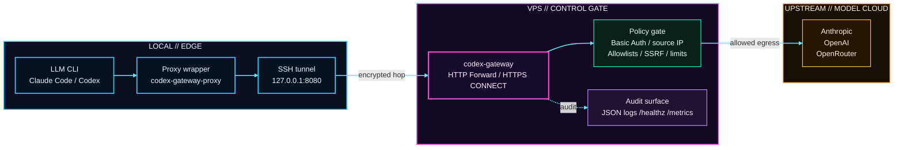

<div align="center">

# Codex Gateway

🚪 A lightweight explicit proxy for Claude Code, Codex, and other proxy-capable LLM CLIs. Run it on your own VPS and keep egress centralized under simple, practical control with Basic Auth, destination allowlists, and audit logs.

[简体中文](./README.md)

</div>

## 🤖 Preferred Flow

If you are using an LLM / agent that can read files, edit files, and run terminal commands, the easiest path is to skip manual YAML editing:

1. `git clone` this repo
2. Send [SEND_THIS_TO_LLM.md](./SEND_THIS_TO_LLM.md) directly to the LLM
3. Answer the small set of follow-up questions it asks
4. Let it read the deploy examples, finish the server deployment on the current machine, and return the client-side config you need

Prefer this flow over the manual quick start below.

## ⚡ Quick Start

Recommended default setup: run the proxy on a VPS and reach it locally through an SSH tunnel.

### Architecture



In the recommended path, the LLM CLI only talks to a local proxy endpoint; egress, authentication, destination policy, and audit all stay on the VPS.

### 1. Deploy the server on the VPS

```bash
cp deploy/vps.example.yaml deploy/vps.yaml
```

Start with these fields:

- `users[0].password`
- If you do not want the default username, also change `users[0].username`
- If you need extra destinations, extend `runtime.dest_suffix_allowlist`

The default sample already includes the common model service domains:

- `.anthropic.com`
- `.openai.com`
- `.openrouter.ai`
- `.chatgpt.com`

Run the deploy:

```bash
go run ./cmd/codex-gateway deploy vps
systemctl --user status codex-gateway.service --no-pager
```

This writes `.env`, `config/users.txt`, the local binary, and the matching `systemd --user` service.

### 2. Deploy the client locally

```bash
cp deploy/client.example.yaml deploy/client.yaml
```

Start with these fields:

- `ssh.user`
- `ssh.host`
- `proxy.password` to match the server-side password
- If you changed the username, change `proxy.username` too

Run the deploy:

```bash
go run ./cmd/codex-gateway deploy client
```

### 3. Use it

```bash
~/.local/bin/codex-gateway-proxy codex
```

If you only want to render files without building or restarting services:

```bash
go run ./cmd/codex-gateway deploy vps --write-only
go run ./cmd/codex-gateway deploy client --write-only
```

## ✨ Core Features

- Standard explicit proxy: HTTP forwarding + HTTPS `CONNECT`
- Access control: Basic Auth, source IP allowlists, per-IP concurrency limits
- Egress control: destination host / suffix / port allowlists
- SSRF protection: re-checks DNS results and blocks private or reserved IPs by default
- Observability: JSON logs, `/healthz`, optional `/metrics`
- Simple deployment: single binary, Docker, Compose, and YAML-based one-click deploy

## 🧭 Design Principles

- This is an explicit proxy, not a vendor API gateway
- The safe default is `127.0.0.1` plus SSH / WireGuard / private ingress
- No protocol rewriting, no upstream API key hosting, no HTTPS MITM
- Defaults stay conservative; open up only what you actually need

## ⚙️ Full Config

- Env-based config: [.env.example](./.env.example)
- Server one-click deploy YAML: [deploy/vps.example.yaml](./deploy/vps.example.yaml)
- Client one-click deploy YAML: [deploy/client.example.yaml](./deploy/client.example.yaml)
- Docker / Compose: [docker-compose.yml](./docker-compose.yml)

Most commonly changed fields:

- `users`
- `DEST_SUFFIX_ALLOWLIST` / `runtime.dest_suffix_allowlist`
- `DEST_HOST_ALLOWLIST`
- `DEST_PORT_ALLOWLIST`
- `SOURCE_ALLOWLIST_CIDRS`
- `PROXY_TLS_ENABLED`
